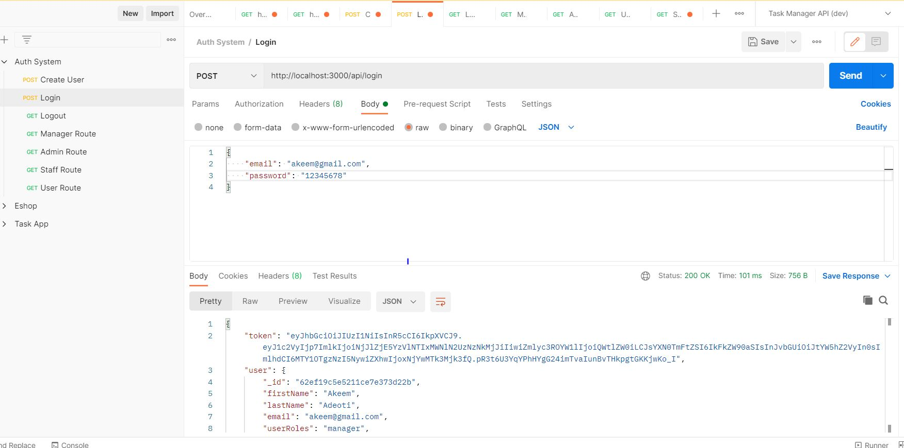
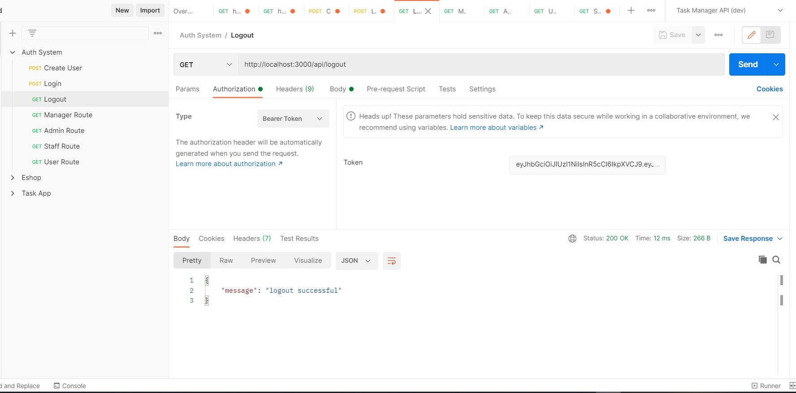
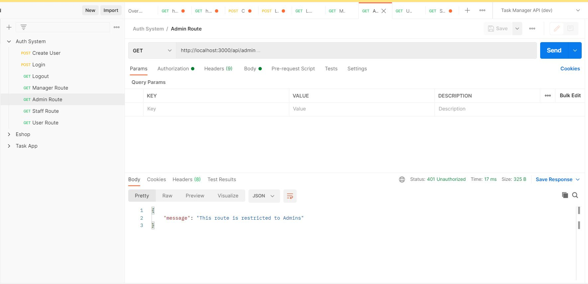
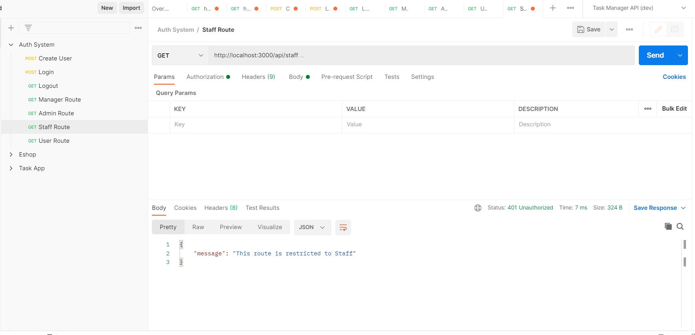
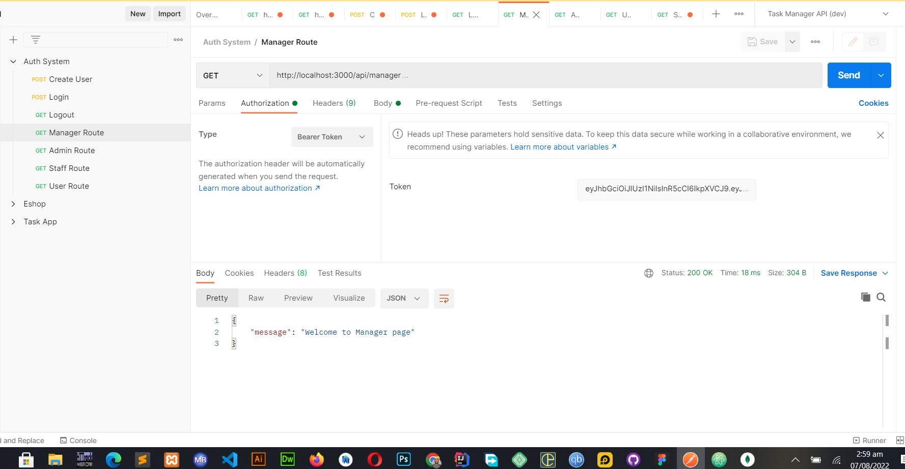
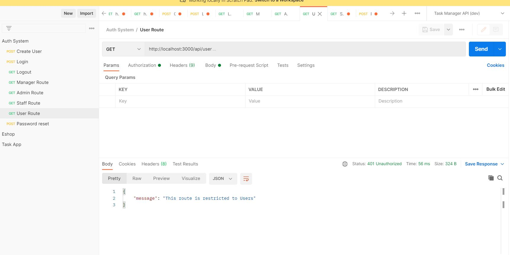

# authentication-system

Set the environment variable below

## Environment Variables

To run this project, you will need to add the following environment variables to your .env file

SECRET

MONGODB_URI

Run the app with node server.js

## Screenshot of api routes
## Register route

## Login route

## Logout route

## Admin route

## Staff route

## Manager route

## User route

